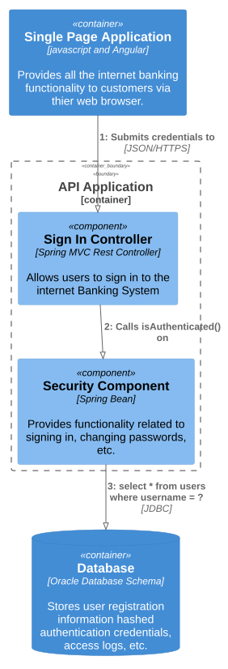

# Dynamic Diagram

`/1 Internet Banking System/Single Page Application/Dynamic Diagram`

* [Overview](../../../README.md)
  * [1 Internet Banking System](../../../1%20Internet%20Banking%20System/README.md)
    * [API Application](../../../1%20Internet%20Banking%20System/API%20Application/README.md)
    * [API Specs](../../../1%20Internet%20Banking%20System/API%20Specs/README.md)
    * [Single Page Application](../../../1%20Internet%20Banking%20System/Single%20Page%20Application/README.md)
      * [**Dynamic Diagram**](../../../1%20Internet%20Banking%20System/Single%20Page%20Application/Dynamic%20Diagram/README.md)
      * [Extended Docs](../../../1%20Internet%20Banking%20System/Single%20Page%20Application/Extended%20Docs/README.md)
  * [2 Deployment](../../../2%20Deployment/README.md)
  * [3 Локализация](../../../3%20%D0%9B%D0%BE%D0%BA%D0%B0%D0%BB%D0%B8%D0%B7%D0%B0%D1%86%D0%B8%D1%8F/README.md)
  * [4 D2 Example](../../../4%20D2%20Example/README.md)

---

[Single Page Application (up)](../../../1%20Internet%20Banking%20System/Single%20Page%20Application/README.md)

---

**Dynamic diagram**

A simple dynamic diagram can be useful when you want to show how elements in a static model collaborate at runtime to implement a user story, use case, feature, etc. This dynamic diagram is based upon a UML communication diagram (previously known as a "UML collaboration diagram"). It is similar to a UML sequence diagram although it allows a free-form arrangement of diagram elements with numbered interactions to indicate ordering.

**Scope**: An enterprise, software system or container.

**Primary and supporting elements**: Depends on the diagram scope; enterprise (see System Landscape diagram), software system (see System Context or Container diagrams), container (see Component diagram).

**Intended audience**: Technical and non-technical people, inside and outside of the software development team.

