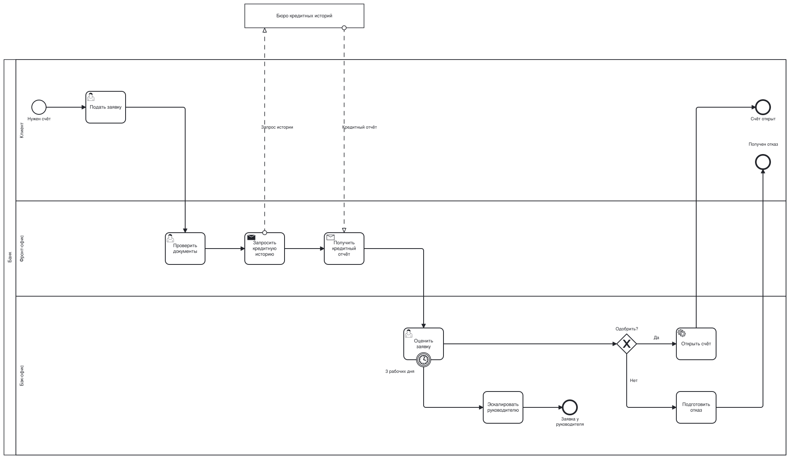

# 5 BPMN Example

`/5 BPMN Example`

* [Overview](../README.md)
  * [1 Internet Banking System](../1%20Internet%20Banking%20System/README.md)
    * [API Application](../1%20Internet%20Banking%20System/API%20Application/README.md)
    * [API Specs](../1%20Internet%20Banking%20System/API%20Specs/README.md)
    * [Single Page Application](../1%20Internet%20Banking%20System/Single%20Page%20Application/README.md)
      * [Dynamic Diagram](../1%20Internet%20Banking%20System/Single%20Page%20Application/Dynamic%20Diagram/README.md)
      * [Extended Docs](../1%20Internet%20Banking%20System/Single%20Page%20Application/Extended%20Docs/README.md)
  * [2 Deployment](../2%20Deployment/README.md)
  * [3 Локализация](../3%20%D0%9B%D0%BE%D0%BA%D0%B0%D0%BB%D0%B8%D0%B7%D0%B0%D1%86%D0%B8%D1%8F/README.md)
  * [4 D2 Example](../4%20D2%20Example/README.md)
  * [**5 BPMN Example**](../5%20BPMN%20Example/README.md)

---

[Overview (up)](../README.md)

---

**Бизнес-процесс в нотации BPMN (третий бэкенд рендера)**

Эта страница демонстрирует BPMN-диаграммы: процесс «Открытие счёта» с пулом «Банк» и его дорожками «Клиент», «Фронт-офис», «Бэк-офис», внешним пулом «Бюро кредитных историй», шлюзом с подписанными ветками, граничным таймером и message flow между пулами.

Файл `.bpmn` содержит только семантическую часть BPMN 2.0 XML: пулы, дорожки, события, задачи, шлюзы и потоки. Координат (секции `bpmndi`) в нём нет — раскладку делает сборка: пулы и дорожки горизонтальными полосами, поток слева направо. Если координаты в файле есть, они игнорируются. Перед раскладкой модель проверяется (несвязанные узлы, узел вне дорожки, sequence flow между пулами и т.п.), ошибки ссылаются на id элемента. Отдельный файл проверяется командой `c4builder check account-opening.bpmn`.

**Область применения**: показать, что `.bpmn`-диаграммы, их раскладка и кириллица корректно попадают в собранный сайт, SVG и PNG без обращений в интернет.

