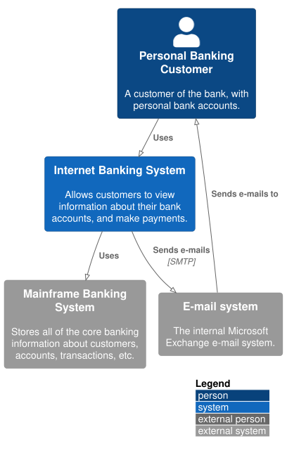

# golden-fixture

* [Overview](#Overview)
  * [1 Internet Banking System](#1-Internet-Banking-System)
    * [API Application](#API-Application)
    * [API Specs](#API-Specs)
    * [Single Page Application](#Single-Page-Application)
      * [Dynamic Diagram](#Dynamic-Diagram)
      * [Extended Docs](#Extended-Docs)
  * [2 Deployment](#2-Deployment)
  * [3 Локализация](#3-%D0%9B%D0%BE%D0%BA%D0%B0%D0%BB%D0%B8%D0%B7%D0%B0%D1%86%D0%B8%D1%8F)
  * [4 D2 Example](#4-D2-Example)

---

## Overview

**Level 1: System Context diagram**

A System Context diagram is a good starting point for diagramming and documenting a software system, allowing you to step back and see the big picture. Draw a diagram showing your system as a box in the centre, surrounded by its users and the other systems that it interacts with.

Detail isn't important here as this is your zoomed out view showing a big picture of the system landscape. The focus should be on people (actors, roles, personas, etc) and software systems rather than technologies, protocols and other low-level details. It's the sort of diagram that you could show to non-technical people.

**Scope**: A single software system.

**Primary elements**: The software system in scope.
Supporting elements: People (e.g. users, actors, roles, or personas) and software systems (external dependencies) that are directly connected to the software system in scope. Typically these other software systems sit outside the scope or boundary of your own software system, and you don’t have responsibility or ownership of them.

**Intended audience**: Everybody, both technical and non-technical people, inside and outside of the software development team.

## 1 Internet Banking System

`/1 Internet Banking System`

[Overview](#golden-fixture)

**Level 2: Container diagram**

Once you understand how your system fits in to the overall IT environment, a really useful next step is to zoom-in to the system boundary with a Container diagram. A "container" is something like a server-side web application, single-page application, desktop application, mobile app, database schema, file system, etc. Essentially, a container is a separately runnable/deployable unit (e.g. a separate process space) that executes code or stores data.

The Container diagram shows the high-level shape of the software architecture and how responsibilities are distributed across it. It also shows the major technology choices and how the containers communicate with one another. It's a simple, high-level technology focussed diagram that is useful for software developers and support/operations staff alike.

**Scope**: A single software system.

**Primary elements**: Containers within the software system in scope.
Supporting elements: People and software systems directly connected to the containers.

**Intended audience**: Technical people inside and outside of the software development team; including software architects, developers and operations/support staff.

**Notes**: This diagram says nothing about deployment scenarios, clustering, replication, failover, etc.

## API Application

`/1 Internet Banking System/API Application`

[Overview](#golden-fixture)

**Level 3: Component diagram**

Next you can zoom in and decompose each container further to identify the major structural building blocks and their interactions.

The Component diagram shows how a container is made up of a number of "components", what each of those components are, their responsibilities and the technology/implementation details.

**Scope**: A single container.

**Primary elements**: Components within the container in scope.
Supporting elements: Containers (within the software system in scope) plus people and software systems directly connected to the components.

**Intended audience**: Software architects and developers.

## API Specs

`/1 Internet Banking System/API Specs`

[Overview](#golden-fixture)

<html lang="en">
<head>
  <meta charset="utf-8" />
  <meta name="viewport" content="width=device-width, initial-scale=1" />
  <meta
    name="description"
    content="SwaggerIU"
  />
  <title>SwaggerUI</title>
  <link rel="stylesheet" href="https://unpkg.com/swagger-ui-dist@4.5.0/swagger-ui.css" />
</head>
<body>

</body>
</html>

## Single Page Application

`/1 Internet Banking System/Single Page Application`

[Overview](#golden-fixture)

**Level 3: Component diagram**

Next you can zoom in and decompose each container further to identify the major structural building blocks and their interactions.

The Component diagram shows how a container is made up of a number of "components", what each of those components are, their responsibilities and the technology/implementation details.

**Scope**: A single container.

**Primary elements**: Components within the container in scope.
Supporting elements: Containers (within the software system in scope) plus people and software systems directly connected to the components.

**Intended audience**: Software architects and developers.

> Example of included local image

## Dynamic Diagram

`/1 Internet Banking System/Single Page Application/Dynamic Diagram`

[Overview](#golden-fixture)

**Dynamic diagram**

A simple dynamic diagram can be useful when you want to show how elements in a static model collaborate at runtime to implement a user story, use case, feature, etc. This dynamic diagram is based upon a UML communication diagram (previously known as a "UML collaboration diagram"). It is similar to a UML sequence diagram although it allows a free-form arrangement of diagram elements with numbered interactions to indicate ordering.

**Scope**: An enterprise, software system or container.

**Primary and supporting elements**: Depends on the diagram scope; enterprise (see System Landscape diagram), software system (see System Context or Container diagrams), container (see Component diagram).

**Intended audience**: Technical and non-technical people, inside and outside of the software development team.

## Extended Docs

`/1 Internet Banking System/Single Page Application/Extended Docs`

[Overview](#golden-fixture)

Multiple markdowns can be ordered using `<name>.1.md, <name>.2.md .. <name>.<n>.md`

You can choose where to place a certain diagram by using ``

Feel free to add any additional details necesary.

## 2 Deployment

`/2 Deployment`

[Overview](#golden-fixture)

**Deployment diagram**

A deployment diagram allows you to illustrate how containers in the static model are mapped to infrastructure. This deployment diagram is based upon a UML deployment diagram, although simplified slightly to show the mapping between containers and deployment nodes. A deployment node is something like physical infrastructure (e.g. a physical server or device), virtualised infrastructure (e.g. IaaS, PaaS, a virtual machine), containerised infrastructure (e.g. a Docker container), an execution environment (e.g. a database server, Java EE web/application server, Microsoft IIS), etc. Deployment nodes can be nested.

**Scope**: A single software system.

**Primary elements**: Deployment nodes and containers within the software system in scope.

**Intended audience**: Technical people inside and outside of the software development team; including software architects, developers and operations/support staff.

## 3 Локализация

`/3 Локализация`

[Overview](#golden-fixture)

**Кириллица в документации**

Эта страница демонстрирует поддержку кириллицы: русский текст в markdown и русские подписи элементов на C4-диаграмме ниже. Диаграмма рендерится локальным PlantUML без обращений в интернет, поэтому сборка работает и в закрытом контуре.

**Область применения**: проверка того, что текст на русском языке корректно попадает в собранный сайт, PDF и SVG-диаграммы.

## 4 D2 Example

`/4 D2 Example`

[Overview](#golden-fixture)

**Диаграмма на D2 (второй бэкенд рендера)**

Эта страница демонстрирует второй бэкенд диаграмм — [D2](https://d2lang.com). Файл с расширением `.d2` рендерится движком D2 (WASM → SVG) наравне с `.puml`; бэкенд выбирается по расширению.

C4-стили (классы `person`, `system`, `external` с фирменными цветами) вынесены в общий `../_c4lib.d2` и подключаются спред-импортом `...@../_c4lib` — это D2-аналог `!include ../styles.iuml` у PlantUML. Префикс `_` помечает файл как библиотеку: c4builder не рендерит его отдельной диаграммой, но резолвит как импорт. Импорты собирает сам c4builder и подаёт движку через виртуальную файловую систему, поэтому внешних обращений в интернет нет и сборка работает в закрытом контуре.

**Область применения**: показать, что `.d2`-диаграммы, их импорты и кириллица корректно попадают в собранный сайт и SVG.

