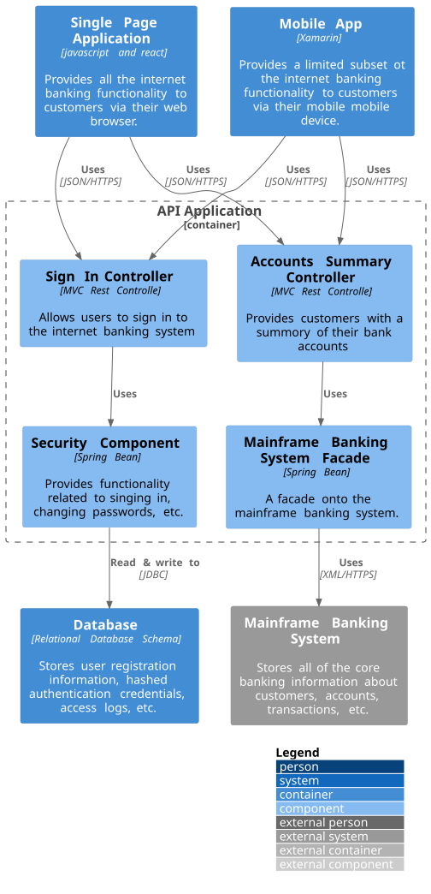

# API Application

`/1 Internet Banking System/API Application`

* [Overview](../../README.md)
  * [1 Internet Banking System](../../1%20Internet%20Banking%20System/README.md)
    * [**API Application**](../../1%20Internet%20Banking%20System/API%20Application/README.md)
    * [API Specs](../../1%20Internet%20Banking%20System/API%20Specs/README.md)
    * [Single Page Application](../../1%20Internet%20Banking%20System/Single%20Page%20Application/README.md)
      * [Dynamic Diagram](../../1%20Internet%20Banking%20System/Single%20Page%20Application/Dynamic%20Diagram/README.md)
      * [Extended Docs](../../1%20Internet%20Banking%20System/Single%20Page%20Application/Extended%20Docs/README.md)
  * [2 Deployment](../../2%20Deployment/README.md)
  * [3 Локализация](../../3%20%D0%9B%D0%BE%D0%BA%D0%B0%D0%BB%D0%B8%D0%B7%D0%B0%D1%86%D0%B8%D1%8F/README.md)

---

[1 Internet Banking System (up)](../../1%20Internet%20Banking%20System/README.md)

---

**Level 3: Component diagram**

Next you can zoom in and decompose each container further to identify the major structural building blocks and their interactions.

The Component diagram shows how a container is made up of a number of "components", what each of those components are, their responsibilities and the technology/implementation details.

**Scope**: A single container.

**Primary elements**: Components within the container in scope.
Supporting elements: Containers (within the software system in scope) plus people and software systems directly connected to the components.

**Intended audience**: Software architects and developers.

