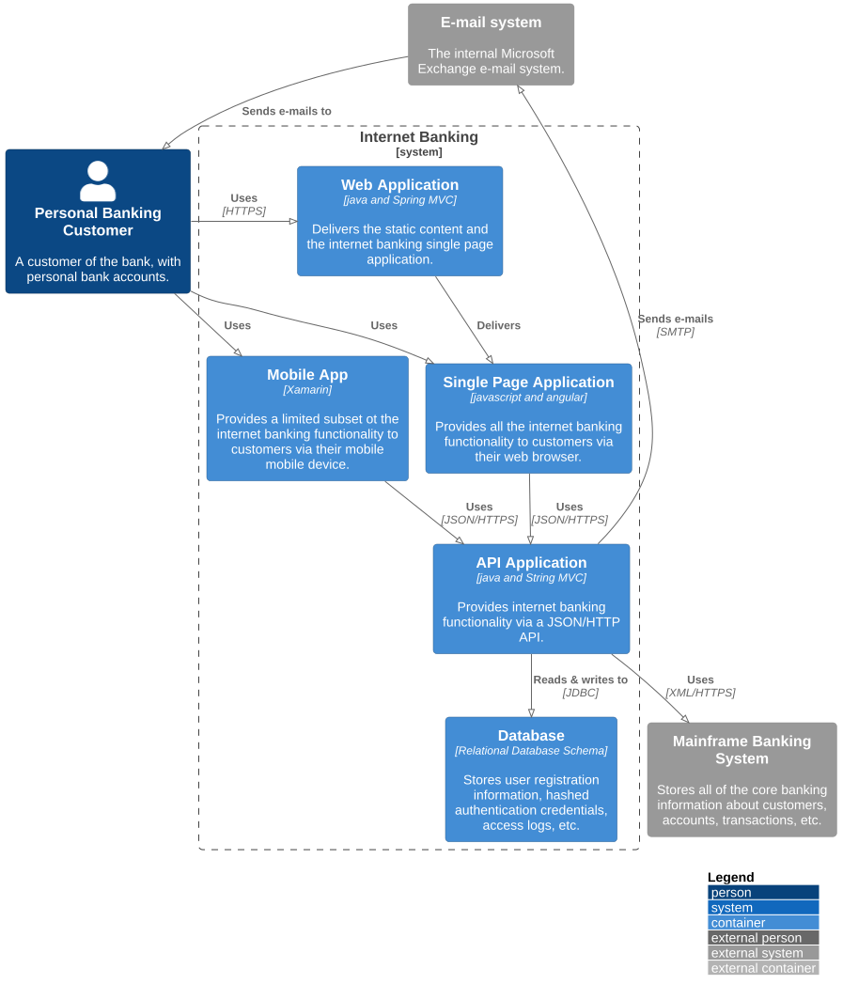

# 1 Internet Banking System

`/1 Internet Banking System`

* [Overview](../README.md)
  * [**1 Internet Banking System**](../1%20Internet%20Banking%20System/README.md)
    * [API Application](../1%20Internet%20Banking%20System/API%20Application/README.md)
    * [API Specs](../1%20Internet%20Banking%20System/API%20Specs/README.md)
    * [Single Page Application](../1%20Internet%20Banking%20System/Single%20Page%20Application/README.md)
      * [Dynamic Diagram](../1%20Internet%20Banking%20System/Single%20Page%20Application/Dynamic%20Diagram/README.md)
      * [Extended Docs](../1%20Internet%20Banking%20System/Single%20Page%20Application/Extended%20Docs/README.md)
  * [2 Deployment](../2%20Deployment/README.md)
  * [3 Локализация](../3%20%D0%9B%D0%BE%D0%BA%D0%B0%D0%BB%D0%B8%D0%B7%D0%B0%D1%86%D0%B8%D1%8F/README.md)

---

[Overview (up)](../README.md)

- [API Application](../1%20Internet%20Banking%20System/API%20Application/README.md)

- [API Specs](../1%20Internet%20Banking%20System/API%20Specs/README.md)

- [Single Page Application](../1%20Internet%20Banking%20System/Single%20Page%20Application/README.md)

---

**Level 2: Container diagram**

Once you understand how your system fits in to the overall IT environment, a really useful next step is to zoom-in to the system boundary with a Container diagram. A "container" is something like a server-side web application, single-page application, desktop application, mobile app, database schema, file system, etc. Essentially, a container is a separately runnable/deployable unit (e.g. a separate process space) that executes code or stores data.

The Container diagram shows the high-level shape of the software architecture and how responsibilities are distributed across it. It also shows the major technology choices and how the containers communicate with one another. It's a simple, high-level technology focussed diagram that is useful for software developers and support/operations staff alike.

**Scope**: A single software system.

**Primary elements**: Containers within the software system in scope.
Supporting elements: People and software systems directly connected to the containers.

**Intended audience**: Technical people inside and outside of the software development team; including software architects, developers and operations/support staff.

**Notes**: This diagram says nothing about deployment scenarios, clustering, replication, failover, etc.

