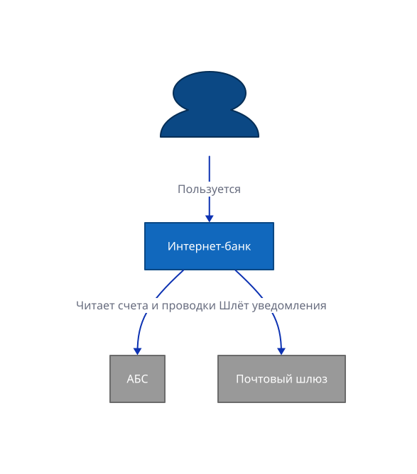

# 4 D2 Example

`/4 D2 Example`

* [Overview](../README.md)
  * [1 Internet Banking System](../1%20Internet%20Banking%20System/README.md)
    * [API Application](../1%20Internet%20Banking%20System/API%20Application/README.md)
    * [API Specs](../1%20Internet%20Banking%20System/API%20Specs/README.md)
    * [Single Page Application](../1%20Internet%20Banking%20System/Single%20Page%20Application/README.md)
      * [Dynamic Diagram](../1%20Internet%20Banking%20System/Single%20Page%20Application/Dynamic%20Diagram/README.md)
      * [Extended Docs](../1%20Internet%20Banking%20System/Single%20Page%20Application/Extended%20Docs/README.md)
  * [2 Deployment](../2%20Deployment/README.md)
  * [3 Локализация](../3%20%D0%9B%D0%BE%D0%BA%D0%B0%D0%BB%D0%B8%D0%B7%D0%B0%D1%86%D0%B8%D1%8F/README.md)
  * [**4 D2 Example**](../4%20D2%20Example/README.md)

---

[Overview (up)](../README.md)

---

**Диаграмма на D2 (второй бэкенд рендера)**

Эта страница демонстрирует второй бэкенд диаграмм — [D2](https://d2lang.com). Файл с расширением `.d2` рендерится движком D2 (WASM → SVG) наравне с `.puml`; бэкенд выбирается по расширению.

C4-стили (классы `person`, `system`, `external` с фирменными цветами) вынесены в общий `../c4lib.d2` и подключаются спред-импортом `...@../c4lib` — это D2-аналог `!include ../styles.iuml` у PlantUML. Импорты собирает сам c4builder и подаёт движку через виртуальную файловую систему, поэтому внешних обращений в интернет нет и сборка работает в закрытом контуре.

**Область применения**: показать, что `.d2`-диаграммы, их импорты и кириллица корректно попадают в собранный сайт и SVG.

